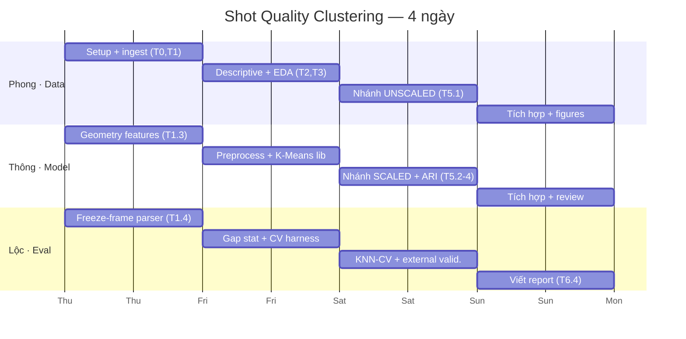

# Kế hoạch 4 ngày — Shot Quality Clustering

**Nhân lực:** 3 người × 4 ngày × 8h = **96 person-hours**
**Chiến lược:** Ngày 1 cả nhóm dựng nền chung → Ngày 2–3 chạy song song 3 nhánh độc lập → Ngày 4 gộp.

---

## 0. Nguyên lý cho phép chạy song song

Pipeline gốc (Task 0→6) vốn **nối tiếp**: Task 4 cần feature list của Task 3, Task 5 cần `X` của Task 4.
Nếu làm đúng thứ tự đó thì 2 trong 3 người sẽ ngồi chờ. Cách gỡ:

> **Đóng băng hợp đồng dữ liệu (data contract) từ cuối Ngày 1.**
> [`DATA_CONTRACT.md`](DATA_CONTRACT.md) quy định sẵn tên cột, dtype, và danh sách feature `X`.
> Từ Ngày 2, Thông viết preprocessing **theo hợp đồng** chứ không chờ kết quả EDA của Phong;
> Lộc viết validation harness và test trên **dữ liệu synthetic** (`make_blobs`) chứ không chờ `X` thật.
> EDA của Phong đóng vai trò *xác nhận hoặc đề nghị sửa* hợp đồng — mọi thay đổi đi qua PR.

Nhờ đó Ngày 2 và Ngày 3 có 3 luồng gần như không phụ thuộc nhau.

---

## NGÀY 1 — Nền chung *(cả 3 cùng làm Task 0 + Task 1)*

**Mục tiêu ra được `data/interim/shots_raw.csv` và đóng băng hợp đồng dữ liệu.**

| Giờ | Hoạt động | Ai |
|---|---|---|
| 09:00–09:45 | Kickoff: đọc `README` + `STRUCTURE` + `WORKFLOW`. Mỗi người tạo branch của mình. | Cả 3 |
| 09:45–10:00 | Chốt scope dữ liệu (đã có sẵn: Euro 2024 + WC 2022, 115 trận) → ghi vào `STATE.md` | LEAD |
| 10:00–12:00 | **Tách 3 luồng song song** (xem bảng dưới) | Phong / Thông / Lộc |
| 13:00–16:00 | Tiếp tục 3 luồng + viết unit test | Phong / Thông / Lộc |
| 16:00–17:00 | **Merge window #1** — cả 3 PR vào `main` | Cả 3 |
| 17:00–17:30 | Phong chạy `scripts/02_extract_shots.py` end-to-end → `shots_raw.csv` | Phong |
| 17:30–18:00 | 🚦 **GATE 1** + đóng băng `DATA_CONTRACT.md` | Cả 3 |

### Chia luồng Ngày 1 (3 file khác nhau → không đụng nhau)

| Người | File sở hữu | Nội dung |
|---|---|---|
| **Phong** | `io_utils.py`, `ingest.py`, `scripts/01,02` | Tải 115 file events, lọc `type.name == "Shot"`, làm phẳng field cơ bản, ghi CSV |
| **Thông** | `features.py`, `tests/test_features.py` | `distance_to_goal`, `angle_to_goal` (định lý cosin, 2 cột dọc), helper one-hot |
| **Lộc** | `freeze_frame.py`, `tests/test_freeze_frame.py` | Parse `shot.freeze_frame` → `n_defenders_in_cone`, `n_opponents_within_3y`, vị trí GK |

`ingest.py` của Phong **gọi** hàm của Thông và Lộc qua interface đã ghi sẵn trong stub — nên 3 người code song song được ngay từ giờ đầu tiên.

### 🚦 GATE 1 — *Definition of Done* (cuối Ngày 1)
- [ ] `data/interim/shots_raw.csv` đã có trên `main`, đúng schema trong `DATA_CONTRACT.md`
- [ ] Số dòng ≈ 2.500–2.700 (đã loại penalty + `period == 5`)
- [ ] Không cột nào có NaN ngoài dự kiến (boolean flags đã `fillna(0)`)
- [ ] Cả 3 người `pd.read_csv()` được trên máy mình
- [ ] `DATA_CONTRACT.md` được đánh dấu **FROZEN**

---

## NGÀY 2 — Song song 3 luồng

| | **Phong — Data/EDA** | **Thông — Modeling** | **Lộc — Eval harness** |
|---|---|---|---|
| **Task** | T2 (thống kê mô tả) + T3 (EDA) | T4 (preprocessing) + thư viện K-Means | Gap statistic + CV harness |
| **Sáng** | `describe()`, phân bố outcome/body_part/shot_type, missing table, lệch mẫu theo đội | Tách X / Y_hidden / ID, one-hot, xử lý missing | `selection_gap.py` — Gap Statistic + reference distribution |
| **Chiều** | Scatter + heatmap trên sơ đồ sân, bảng so sánh scale, ma trận tương quan | `StandardScaler` → `X_scaled.csv` + `X_unscaled.csv`; `clustering.py` + `selection.py` (elbow, silhouette) | `validation.py` — ARI + KNN k-fold CV; `viz.py` |
| **Test trên** | dữ liệu thật | dữ liệu thật | **`make_blobs` synthetic** (không cần chờ B) |
| **Output** | `reports/tables/t2_*.csv`, `figures/phong_t3_*.png`, đề xuất chốt feature list | `data/processed/X_{scaled,unscaled}.csv` | 3 module đã có unit test pass |

> **Chú ý cho Phong:** kết quả EDA có thể đề nghị bỏ feature dư thừa (ví dụ `x` tương quan rất cao với
> `distance_to_goal`). Đây là **thay đổi hợp đồng** → mở PR sửa `config.FEATURE_COLS`, báo Thông ngay trong ngày,
> không tự đổi im lặng.

### 🚦 GATE 2 (cuối Ngày 2)
- [ ] `X_scaled.csv` + `X_unscaled.csv` trên `main`, cùng số dòng, join được với `shot_id`
- [ ] `pytest` pass toàn bộ
- [ ] `validation.py` chạy được end-to-end trên synthetic data
- [ ] Feature list cuối cùng đã chốt trong `config.py`

---

## NGÀY 3 — Chạy thí nghiệm

| | **Phong — nhánh UNSCALED** | **Thông — nhánh SCALED** | **Lộc — kiểm định** |
|---|---|---|---|
| **Sáng** | K-Means trên `X_unscaled`, k=2..10 → Elbow + Silhouette + Gap | K-Means trên `X_scaled`, k=2..10 → Elbow + Silhouette + Gap | Hoàn thiện `evaluate.py`; chuẩn bị bảng external validation |
| **14:00** | → nộp `labels_unscaled.csv` | → nộp `labels_scaled.csv` **(handoff cho C)** | ← nhận nhãn |
| **Chiều** | Bảng "3 phương pháp có đồng thuận k không?" + nhận xét | Tính **ARI** giữa 2 nhánh; chốt phiên bản chính thức (T5.4) | KNN 5-fold CV, thử k-neighbors ∈ {3,5,7,9} → accuracy ± std; bảng goal rate + xG theo cụm |

> Cả Phong và Thông đều **gọi chung** `clustering.py` + `selection.py` của Thông, không ai copy code.
> Đây vừa là chống conflict, vừa đảm bảo khác biệt giữa 2 nhánh chỉ đến từ scaling (biến kiểm soát L2 giữ nguyên).

### 🚦 GATE 3 (cuối Ngày 3)
- [ ] Bảng chọn K cho cả 2 nhánh (Elbow / Silhouette / Gap)
- [ ] Con số **ARI** giữa scaled vs unscaled
- [ ] **CV accuracy ± std** của KNN
- [ ] Bảng external validation: `cluster_id × n_shots × goal_rate × mean_xG`

---

## NGÀY 4 — Tích hợp & Báo cáo

| Giờ | Hoạt động | Ai |
|---|---|---|
| 09:00–10:00 | Merge cả 3 branch vào `main`, giải quyết conflict còn lại | Cả 3 |
| 10:00–12:00 | **Chạy lại toàn bộ pipeline từ đầu trên `main`** (reproducibility check) | Phong chạy, Thông + Lộc xem |
| 13:00–15:00 | Viết `reports/final_report.md`: mục đích → EDA → thiết kế TN → kết quả → kết luận + hạn chế | Lộc viết, Phong + Thông cấp số liệu |
| 15:00–16:00 | Hoàn thiện figures, đánh số bảng biểu, rà lại `DECISIONS.md` | Cả 3 |
| 16:00–18:00 | 🅱️ **Buffer** — dự phòng cho việc phát sinh | Cả 3 |

### 🚦 GATE 4 (cuối Ngày 4)
- [ ] `final_report.md` đủ 4 bảng kết quả + 3 biểu đồ
- [ ] Pipeline chạy lại từ repo sạch cho ra đúng số liệu trong report
- [ ] `README.md` cập nhật kết quả chính
- [ ] `DECISIONS.md` ghi đủ mọi lựa chọn kỹ thuật

---

## Quản lý rủi ro tiến độ

### Danh sách cắt phạm vi (descope) — thống nhất TRƯỚC, dùng khi trễ

Khi một gate trễ **quá 2 giờ**, cắt theo đúng thứ tự sau, không tranh luận lại:

| Nếu gate trễ | Cắt gì | Tiết kiệm | Ảnh hưởng |
|---|---|---|---|
| GATE 1 | Bỏ feature từ `freeze_frame` (`n_defenders_in_cone`…) | ~4h của Lộc | Feature set vẫn hợp lệ, chỉ kém phong phú |
| GATE 1 | Bỏ WC 2022, chỉ dùng Euro 2024 | ~1,5h | Còn 1.304 shot — **vẫn đủ** cho k≤10 + 5-fold CV |
| GATE 2 | Bỏ Gap Statistic, giữ Elbow + Silhouette | ~4h của Lộc | Mất 1 trong 3 phương pháp chọn K |
| GATE 2 | Bỏ T2.3 (phân bố body_part/technique) + T2.4 (lệch mẫu theo đội) | ~1,5h của Phong | Mất 2 bảng mô tả phụ; **không** ảnh hưởng feature set hay kết quả cụm |
| GATE 3 | K range 2..8 thay vì 2..10 | ~1h | Ít lựa chọn K hơn |
| GATE 3 | Chốt cứng `k_neighbors=5`, bỏ tuning {3,5,7,9} | ~1h | Không có đường cong tuning KNN |

### Quy tắc "swarm"
Ai xong việc sớm **không nhận task mới**, mà sang hỗ trợ người đang có thẻ ở cột *Đang gặp vấn đề*.
Vì ma trận sở hữu cấm commit đè file người khác → hỗ trợ bằng **pair-programming** (người chủ file
vẫn là người commit), hoặc nhận phần *test* / *figure* của task đó.

### Standup 15 phút — 09:00 mỗi ngày
Mỗi người trả lời 3 câu, LEAD ghi vào [`STATE.md`](STATE.md):
1. Hôm qua xong thẻ nào? 2. Hôm nay làm thẻ nào? 3. Có gì đang tắc không?

Sau standup, LEAD tạo thẻ UI cho ngày mới — nội dung chép từ `docs/board/*.md`, format ở
[`WORKFLOW.md`](WORKFLOW.md) §1.
